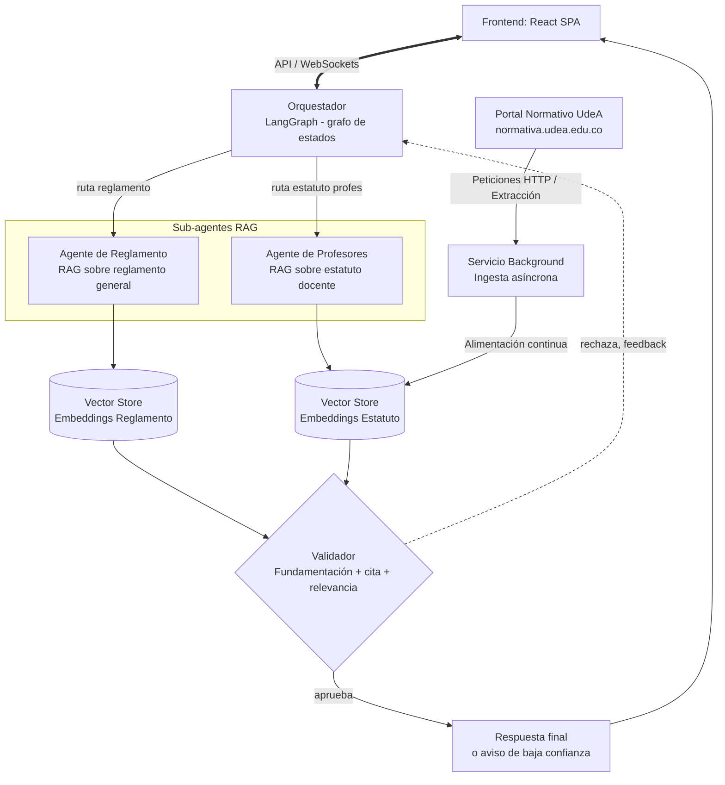

# normativa-agentica

Proyecto para construir agentes orientados a normativa, con orquestacion por grafo de estados y rutas especializadas para documentos internos y consulta web en vivo.

## Arquitectura objetivo

El sistema separa responsabilidades por tipo de consulta y valida la calidad de la respuesta antes de entregarla al usuario.



## Patrones arquitectonicos

- Patron orquestador y subagentes.
- Patron supervisor.
- Agentes como tools.

## Componentes Implementados

### Orquestador
Componente central que enruta consultas hacia el agente especializado correcto.
- ✅ Routing por keywords + LLM fallback
- ✅ Mocks para testing
- ✅ Entry points inyectables para componentes reales

**Documentación completa:** [docs/orchestrator-implementation.md](docs/orchestrator-implementation.md)

## Stack recomendado para desarrollo y produccion

### Objetivo del entorno

- Crear agentes modulares y extensibles.
- Probar flujos localmente con trazas claras.
- Gestionar configuracion por entorno sin secretos en codigo.
- Escalar a API/servicio productivo sin rehacer la base.

### Dependencias base

#### Orquestacion y agentes

- langchain
- langgraph
- langchain-openai (u otro proveedor)
- langchain-community

#### Configuracion y validacion

- python-dotenv
- pydantic
- pydantic-settings

#### Desarrollo y calidad

- rich
- pytest
- pytest-asyncio
- ruff
- mypy

### Produccion

#### API y ejecucion

- fastapi
- uvicorn
- gunicorn (opcional segun despliegue)

#### Observabilidad

- langsmith
- logging estandar o structlog
- opentelemetry-api y opentelemetry-sdk

#### Persistencia y estado

- sqlalchemy
- alembic
- sqlite en desarrollo
- postgresql en produccion

#### Memoria y busqueda vectorial

- chromadb para prototipos
- faiss-cpu para uso local de alto rendimiento
- pgvector cuando se trabaja con PostgreSQL

### Utilidades opcionales

- httpx
- tenacity
- cachetools
- orjson
- typer
- docker

## Estructura sugerida

```txt
app/
	agents/
	tools/
	prompts/
	memory/
	api/
	core/
tests/
docs/
.env.example
main.py
pyproject.toml
README.md
```

## Mejores practicas

- Mantener configuracion en variables de entorno.
- Separar agentes, tools y prompts por modulos.
- Validar entradas y salidas con pydantic.
- Implementar pruebas unitarias por tool y por flujo.
- Instrumentar trazas desde el inicio.
- Empezar con pocas dependencias y crecer por necesidad.
- Documentar secretos requeridos en .env.example.
- Fijar versiones cuando el sistema entre en fase estable.

## Arranque minimo recomendado

Base inicial para comenzar rapido:

- langchain
- langgraph
- python-dotenv
- pydantic
- pytest
- ruff
- rich
Documento de detalle adicional: [docs/stack-recomendado.md](docs/stack-recomendado.md)
